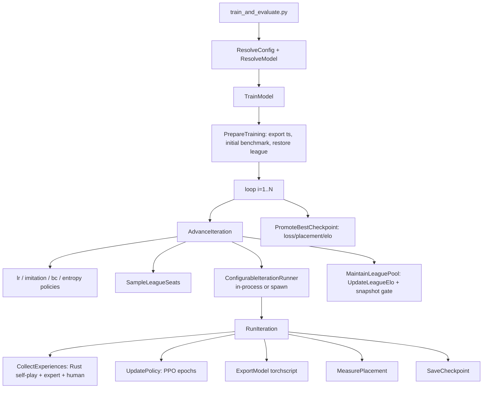

# training-lab RL Pipeline Review

A focused review of the iterative-PPO training pipeline that lives under
`training-lab/`: configs (`warm-up.yaml`, `handoff.yaml`, `self-play.yaml`),
the hexagonal use-case / adapter code under `training/`, and the pytest
suite under `tests/`.

The review is grouped into:

1. Pipeline architecture at a glance
2. Warm-up config audit
3. Handoff config audit
4. Self-play config audit
5. Bugs / risk hot-spots in the code
6. Testing suite — what is covered today
7. Test gaps to backfill, by priority
8. Recommended follow-up sequence

---

## 1. Pipeline architecture at a glance

Entry point: [`training-lab/train_and_evaluate.py`](train_and_evaluate.py)
→ `Container.train_model(config)` in
[`training/container.py`](training/container.py)
→ `TrainModel.execute` in
[`training/use_cases/train_model/orchestrator.py`](training/use_cases/train_model/orchestrator.py).



The hexagonal split is genuinely clean:

- `training/use_cases/*` orchestrates pure logic and depends only on
  `training/ports/*` and `training/entities/*`.
- `training/adapters/*` wires torch (`PPOAdapter`, `TorchModelAdapter`),
  Rust (`RustSelfPlay`, `SessionBenchmark`), JSON persistence, and the
  terminal presenter.
- The contracts in [`pyproject.toml`](pyproject.toml) (`importlinter`)
  enforce that use cases never import adapters, infrastructure, numpy,
  pandas, JSON/YAML, sockets, etc. Worth keeping green in CI.

### Structural housekeeping

- A parallel `src/training_lab/` package tree exists but contains only
  empty `__pycache__` dirs. Either delete it or commit to it; right now
  it confuses ownership.
- Three scratch files at the lab root —
  [`test_real_ui.py`](test_real_ui.py),
  [`test_ui.py`](test_ui.py),
  [`test_ui2.py`](test_ui2.py) — are essentially identical fragments of
  presenter scaffolding. Move into `tests/` or delete; pytest currently
  ignores them only because `pyproject.toml` sets `testpaths = ["tests"]`.

---

## 2. Warm-up config audit — [`configs/warm-up.yaml`](configs/warm-up.yaml)

Intent: action-level behavioral cloning onto `bot_v5` while keeping the
value head learning. Mostly sound, but four sharp edges deserve a look.

### Sharp edges

1. **`policy_coef: 0` + `explore_rate: 0` + `behavioral_clone_coef: 1.50`.**
   Self-play generates 10 000 deterministic games per iteration, but the
   PPO policy gradient is zeroed out, so those games only feed the value
   and entropy terms — none of the self-play decisions contribute to the
   BC loss because their `behavioral_clone_mask` is `False`
   ([`ppo_batch_preparation.py`](training/adapters/ppo/ppo_batch_preparation.py)).
   With `ppo_epochs: 4` over 10 000 self-play decisions plus the 20 000
   expert games, you are paying full self-play cost for marginal benefit.
   Either drop `games` to ~500–1000 during warm-up, or set `policy_coef`
   to a small non-zero value so the rollouts aren't wasted.

2. **Oracle distillation knobs are present but always inert here.**
   `train_and_evaluate.py` calls
   `resolve.from_scratch(hidden_size=..., model_arch=config.model_arch)`
   and never passes `oracle_critic=True`. The gate in
   `CollectExperiences.execute`
   ([`collect_experiences.py`](training/use_cases/collect_experiences.py))
   reads:

   ```python
   include_oracle_states = bool(
       identity.oracle_critic
       and (iter_imitation_coef if iter_imitation_coef is not None else config.imitation_coef) > 0.0
   )
   ```

   so for fresh models `include_oracle_states` is always `False` and the
   `use_oracle_distill` block in
   [`torch_ppo.py`](training/adapters/ppo/torch_ppo.py) never fires.
   That's fine for warm-up (where `imitation_coef: 0.00`), but the same
   gating silently disables the *entire* "Latent Distillation" stage in
   `handoff.yaml` and `self-play.yaml`. Either plumb `oracle_critic`
   from CLI/YAML, or drop the imitation knobs from the YAMLs that imply
   it works.

3. **`best_model_metric: "elo"` with `snapshot_interval: 9999`** and
   only one opponent (`bot_v1` at `initial_elo: 800`). With
   `elo_outplace_unit_weight: 50`, K = 32 × 50 = 1600 per iteration, so
   one iteration can swing learner Elo by hundreds of points. That's
   fine for sampling-weight dynamics but hostile for model selection —
   the "best" checkpoint is essentially picked by Elo-noise. During BC,
   prefer `best_model_metric: "loss"`.

4. **`behavioral_clone_games_per_iteration: 20000`** invokes
   `te.generate_expert_data(20000)` every iteration via
   [`expert_replay.py`](training/adapters/ppo/expert_replay.py). The
   expert payload is regenerated every iter (no caching). Either cache
   to disk or cut to ~2000–5000 and run more iterations.

### Minor

- `gamma: 0.995 / gae_lambda: 0.98` is sound because rewards are gated
  to terminals in
  [`ppo_batch_preparation.py`](training/adapters/ppo/ppo_batch_preparation.py)
  via `sorted_rewards[~is_terminal] = 0.0`. A one-line comment in the
  YAML referencing that behaviour would help future readers.
- `entropy_coef: 0.001` on a constant schedule is fine during BC.

---

## 3. Handoff config audit — [`configs/handoff.yaml`](configs/handoff.yaml)

- **BC fade-out is wired correctly.**
  `behavioral_clone_schedule: linear, coef: 0.50 → 0.0` over 100
  iterations is computed by `DefaultBehavioralCloneCoefPolicy` in
  [`use_cases/train_model/policies.py`](training/use_cases/train_model/policies.py)
  and reaches both `UpdatePolicy.set_behavioral_clone_coef` and
  `CollectExperiences`'s expert-data gate. Note the cost: as long as
  `effective_bc_coef > 0 and games_per_iter > 0 and teacher is not None`,
  expert data is loaded every iteration; only the very last iteration
  (where the linear schedule hits 0.0) skips the expensive expert pull.

- **`imitation_coef: 0.10` is a no-op without an oracle critic** — see
  §2 caveat 2. The headline "Oracle Coach" feature simply does nothing
  on the default `--new` model.

- **`min_nn_per_game: 2` with only 2 heuristic opponents and
  `snapshot_interval: 10`.** Until the first snapshot is admitted (and
  the snapshot Elo gate from
  [`maintain_league_pool.py`](training/use_cases/maintain_league_pool.py)
  is non-trivial), the pool has 2 entries. `SampleLeagueSeats` samples 3
  seats from those 2 entries, then the deficit-fill rule promotes
  rightmost slots to `nn`. The early-handoff curriculum is therefore
  effectively `nn,bot_v1|bot_v3,bot_v1|bot_v3,nn` — confirm that's
  what you want.

- **`lr_schedule: elo` is a passthrough** for `scheduled_lr`
  ([`training_config.py`](training/entities/training_config.py)) then
  Elo-decayed by `DefaultLearningRatePolicy` /
  `LeagueEloLearningRatePolicy`. The
  `test_scheduled_lr_elo_is_passthrough` regression in
  [`test_train_model.py`](tests/test_train_model.py) protects this.

---

## 4. Self-play config audit — [`configs/self-play.yaml`](configs/self-play.yaml)

- **`imitation_schedule: gaussian_elo`**
  (`imitation_center_elo: 1450, imitation_width_elo: 250`) routes
  through `EloGaussianILPolicy` via `Container._default_imitation_policy`
  ([`container.py`](training/container.py)). Tests cover symmetry, EMA
  smoothing, and the floor cutoff. Same caveat as above: needs an
  oracle-critic model to actually do anything.

- **`entropy_schedule: elo`** routes through `EloDecayEntropyPolicy`,
  which applies the same `elo_based_lr` power-law interpolation used
  for the LR. So as the learner climbs from 800 → 2000 Elo, both LR and
  entropy decay together — that's a deliberate design choice and
  protected by the EMA-smoothing tests.

- **`benchmark_checkpoints: [..., 149]` but `iterations: 100`.** The
  `149` value is dropped silently because no iteration ever equals it.
  `ResolveConfig.resolve` should warn (or drop) requested checkpoint
  numbers that exceed `iterations`.

- **`min_nn_per_game: 2, sampling: matchmaking`** plus opponents
  spanning 800 → 2000 Elo. `SampleLeagueSeats` fills the NN deficit
  from the right, which means against the strongest opponents you'll
  often kick `bot_m6` (the rightmost-sampled) out into an NN seat,
  losing some Elo signal on M6 specifically. Documented by
  `test_sample_league_seats_enforces_min_nn` in
  [`test_league.py`](tests/test_league.py).

- **`concurrency: 256, iteration_runner_mode: spawn,
  iteration_runner_restart_every: 10`.** The
  [`SpawnIterationRunner`](training/adapters/iteration_runners/spawn.py)
  calls `ppo.setup(init.weights, init.config, init.device)` inside the
  worker on every respawn, which rebuilds `optim.Adam` from scratch.
  **Adam momentum is reset every 10 iterations.** If that's intentional
  (it reclaims allocator state and acts as a mild LR reset), document
  it; otherwise persist optimizer state across respawns.

---

## 5. Bugs / risk hot-spots in the code

Listed roughly in descending priority.

1. **`train_and_evaluate.py` rebuilds `TrainingConfig` by hand, twice.**
   In both the `--checkpoint` branch (~lines 214–249) and the save_dir
   block (~lines 266–301), every field is enumerated explicitly. New
   fields on `TrainingConfig` (e.g. `policy_coef`, `outplace_session_size`,
   `gamma`, `gae_lambda`, `clip_epsilon`, `value_coef`) are not always
   propagated through both branches. Use `dataclasses.replace(config, ...)`
   — this is the single highest-leverage refactor; it eliminates a whole
   class of silent regressions when adding new knobs.

2. **`oracle_critic` flag never plumbed from CLI/YAML.**
   `resolve.from_scratch(hidden_size=hidden_size, model_arch=config.model_arch)`
   in [`train_and_evaluate.py`](train_and_evaluate.py) never sets
   `oracle_critic=True`. Every imitation/distillation schedule silently
   no-ops on fresh models. Add `--oracle-critic` to the CLI and an
   `oracle_critic:` key to the YAML loader.

3. **`prepare_batched` uses `gids = game_ids_np % scores_np.shape[0]`**
   in [`ppo_batch_preparation.py`](training/adapters/ppo/ppo_batch_preparation.py).
   The modulo is correct after `merge_experiences` (extra `game_ids` are
   offset by `n_primary_games`), but it would also silently mask out a
   genuinely bad primary payload. Add an explicit invariant check
   (`assert game_ids_np.max() < scores_np.shape[0]` after merge).

4. **`SessionBenchmark.measure_placement` hard-codes `explore_rate=0.0`
   and `session_size=50`.** `MeasurePlacement` and `PrepareTraining`
   also pass `session_size=50` literally. Three call-sites,
   one magic number. Collapse into `config.outplace_session_size`.

5. **`UpdateLeagueElo` uses `K = 32 * elo_outplace_unit_weight`,**
   defaulting to `K = 32 * 50 = 1600` per iteration when
   `elo_outplace_unit_weight` defaults to `outplace_session_size`. With
   a one-opponent warm-up pool this produces hundreds of Elo points of
   swing per iteration and turns `best_model_metric: "elo"` into a
   near-random selector. Either reduce the default, taper K with sample
   count, or document the math prominently in
   [`update_league_elo.py`](training/use_cases/update_league_elo.py).

6. **`SpawnIterationRunner` drops Adam state on every worker respawn**
   (see §4). Confirm intent.

7. **The `_mode_id_from_state` shim is duplicated three times** — in
   [`rust_self_play_adapter.py`](training/adapters/self_play/rust_self_play_adapter.py),
   [`expert_replay.py`](training/adapters/ppo/expert_replay.py),
   and
   [`jsonl_human_replay.py`](training/adapters/ppo/jsonl_human_replay.py).
   Centralise in one helper module, or — better — require the engine to
   always emit `game_modes` and delete the shim entirely.

8. **`_parse_league` defaults `sampling='pfsp'`** in
   [`resolve_config.py`](training/use_cases/resolve_config.py) but all
   three shipped YAMLs use `uniform` or `matchmaking`. A user who drops
   the `sampling` key thinking they're getting "the default we use"
   actually gets PFSP. Either change the default to `uniform` or
   document loudly.

---

## 6. Testing suite — what is covered today

[`tests/`](tests) contains nine files covering each layer of the hexagon.

| Layer            | Files                                                                                                                    | What it asserts                                                                                                                                  |
|------------------|--------------------------------------------------------------------------------------------------------------------------|--------------------------------------------------------------------------------------------------------------------------------------------------|
| Use cases        | [`test_train_model.py`](tests/test_train_model.py), [`test_training_loop_use_cases.py`](tests/test_training_loop_use_cases.py), [`test_iteration_use_cases.py`](tests/test_iteration_use_cases.py), [`test_league.py`](tests/test_league.py) | Full TrainModel orchestration, snapshot gates, league restore, PrepareTraining/AdvanceIteration/PromoteBestCheckpoint, CollectExperiences/UpdatePolicy/SaveCheckpoint, all League math |
| Adapters         | [`test_rust_self_play_adapter.py`](tests/test_rust_self_play_adapter.py), [`test_torch_model_adapter.py`](tests/test_torch_model_adapter.py), [`test_ppo_human_experiences.py`](tests/test_ppo_human_experiences.py) | `compute_run_stats` semantics, checkpoint round-trip and TorchScript load, JSONL human-data load+merge happy path                             |
| End-to-end guard | [`test_learning_overfit_regression.py`](tests/test_learning_overfit_regression.py)                                       | `clip_epsilon` and `policy_coef` wiring, PPO can overfit a tiny batch, legal-mask invariant, Rust GAE closed-form, `state_dict` determinism      |
| Config           | [`test_resolve_config.py`](tests/test_resolve_config.py)                                                                 | League Elo weight default behaviour, `policy_coef`, BC fields                                                                                    |

Strong where it matters most: PPO wiring, GAE math, legal-mask safety,
league Elo math, config merge, persistence round-trip.

---

## 7. Test gaps to backfill, by priority

### Must-have (bug-adjacent)

- **`ppo_batch_preparation.prepare_batched`**: terminal-reward masking,
  per-minibatch value-target normalisation inputs, advantage
  normalisation, `behavioral_clone_mask` default when absent,
  `oracle_states=None` path. Also the
  `game_ids % scores.shape[0]` invariant against a merged primary+expert
  batch.
- **`RunIteration` composition**: a fast test mocking
  `SelfPlayPort/PPOPort/ModelPort/BenchmarkPort/PresenterPort` to verify
  call ordering and that `run_benchmark=False` carries forward
  `prev_placement` without invoking `benchmark.measure_placement`.
- **`ConfigurableIterationRunner.setup`**: mode dispatch (in-process vs
  spawn) and `teardown` idempotency.
- **`expert_replay.load_expert_experiences`**: variable-length mask
  padding per decision type, `game_ids` uniqueness,
  `behavioral_clone_mask=all True`, and the `teacher != 'bot_v5'`
  `ValueError`.
- **`EloDecayEntropyPolicy` and `EloGaussianILPolicy`** when
  `entropy_coef_min<=0` or `imitation_width_elo=0` (boundary
  conditions).

### Should-have (curriculum correctness)

- **`ResolveConfig` end-to-end**: oracle_critic toggle, real
  YAML-loader-backed assertions for `handoff.yaml` and `self-play.yaml`
  (load each via `YAMLConfigLoader` and assert the resolved
  `TrainingConfig` matches expected values). Also assert that
  `benchmark_checkpoints` values exceeding `iterations` are dropped or
  warned about.
- **`scheduled_coef` for `exponential` / `geometric`** — currently
  untested.
- **`LeagueEloLearningRatePolicy` vs `DefaultLearningRatePolicy`**: both
  implement the same `elo_based_lr` helper. Add a parametrised test
  that they agree across the Elo range — guards against accidental
  divergence when one is touched.
- **`MaintainLeaguePool`**: `max_active_snapshots=0` path (no snapshots
  admitted), `snapshot_elo_delta=0` (every gate passes), heuristic
  opponents never evicted even when `nn_checkpoint` count reaches the
  cap.

### Nice-to-have (ops)

- **`SpawnIterationRunner`**: fake `adapter_factory` returning mock
  ports + in-memory queues; assert that `restart_every` respawns a
  worker and that presenter events are forwarded. Test that `teardown`
  is safe to call twice.
- **`SessionBenchmark.measure_placement`**: a stubbed `tarok_engine`
  like in `test_rust_self_play_adapter.py`, verifying session bucketing
  and the `placements` default when `n_total < session_size`.
- **`jsonl_human_replay.load_human_experiences`**: malformed files,
  missing `final_score`, mixed rounds — currently only the happy path
  is tested.
- **`train_and_evaluate._resolve_path`**: with `--config configs/foo.yaml`
  vs absolute path vs cwd resolution. Plus a regression test that the
  second `TrainingConfig` rebuild after the `--checkpoint` branch
  preserves every field (until item 1 in §5 is fixed).
- **`promote_best_checkpoint`** for `best_model_metric="elo"` without
  any `learner_elo` set on results (defensive path).

---

## 8. Recommended follow-up sequence

1. Fix item 1 from §5 (`dataclasses.replace`) — small change, removes a
   recurring footgun.
2. Fix item 2 (`oracle_critic` plumbing) and either remove or activate
   the imitation/distillation knobs in `handoff.yaml` and
   `self-play.yaml`.
3. Land the **must-have** tests from §7.
4. Address items 3–5 from §5 (invariant check, session-size collapse,
   K-factor sanity), then ship the **should-have** tests.
5. Tackle items 6–8 from §5 and the **nice-to-have** tests opportunistically.
